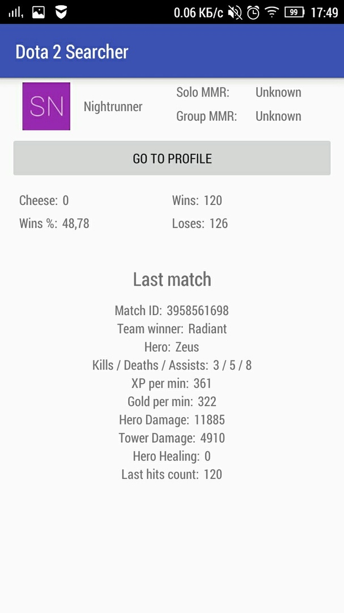

# About 
This is education project for summer school by <a href="https://surfstudio.ru/">Surf studio</a>  
## Certificate proof
Acquired the basic skill of Android developing.  
  

## About functionality

You can find(very slow) list of players **Dota 2** by nickname and see themselves statistic, profiles links and info about last match.

## About design

Application has two activities: SearchPlayer and PlayerInfo

### Search Player

### Player Info
#### Scheme

#### Example

# Few words

It has many shortcomings, but this is my first android app ever.
